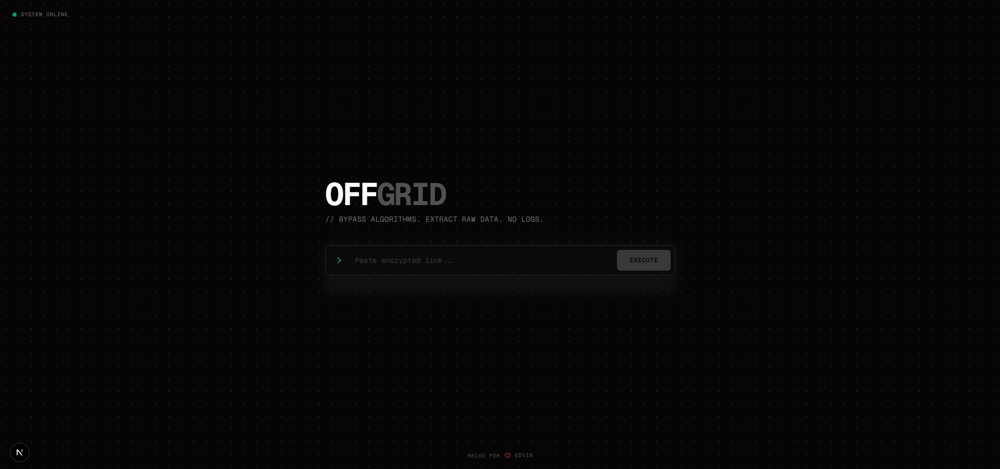
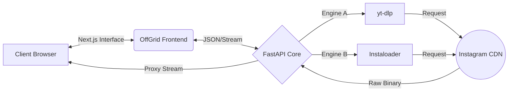

<div align="center">

# ⚡ OFFGRID

### The High-Fidelity Media Extraction Protocol




  <p align="center">
    <strong>Bypass Algorithms. Extract Raw Data. Zero Logs.</strong>
  </p>

</div>

---

## 📡 The Protocol

**OffGrid** is not just a downloader; it's a privacy-first extraction tunnel. It bypasses Instagram's algorithm tracking and CDN restrictions to deliver **raw, uncompressed media** directly to your local drive.

Designed for archivists, designers, and developers who demand the highest fidelity without compromising privacy.

### 💎 Key Capabilities

| Feature                 | Description                                                        |
| :---------------------- | :----------------------------------------------------------------- |
| **🔐 Privacy First**    | No database. No history tracking. No third-party API keys.         |
| **⚡ Dual-Engine Core** | Hybrid `yt-dlp` + `Instaloader` system ensures 99.9% success rate. |
| **🛡️ Secure Tunneling** | Local proxy streaming bypasses CORS & "Hotlink" protection.        |
| **🎛️ Cyber Interface**  | Brutalist UI with real-time feedback and technical aesthetics.     |

---

## 🏗️ System Architecture

The system operates on a decoupled **Client-Server** model to ensure modularity and resilience.



### 🧠 The Core (Backend)

Written in **Python (FastAPI)**. It acts as the brain, intelligently switching between extraction engines based on the content type (Reels vs Images) and network conditions.

### 👁️ The Interface (Frontend)

Built with **Next.js 14**, **Tailwind**, and **Framer Motion**. It provides a "hacker-console" experience, featuring real-time terminal logs, scanline effects, and zero-dependency hydration.

---

## ⚡ Quick Start

Initialize the protocol in two separate terminal instances.

### 1. Ignite the Core (Backend)

```bash
cd backend

# Create virtual environment (Recommended)
python -m venv venv
# Windows: .\venv\Scripts\activate  |  Mac/Linux: source venv/bin/activate

# Install dependencies
pip install -U yt-dlp instaloader fastapi uvicorn requests

# Launch Server
python server.py
```

> _Core status: Listening on Port 8000_

### 2. Launch Interface (Frontend)

```bash
# Install Node dependencies
pnpm install

# Deploy visual layer
pnpm dev

```

> _Access console at: `http://localhost:3000_`

---

## 🛠️ Tech Stack

<div align="center">

| **Layer**      | **Technology** | **Role**                       |
| -------------- | -------------- | ------------------------------ |
| **Frontend**   |                | SSR & UI Rendering             |
| **Styling**    |                | Cyber-Industrial Design System |
| **Server**     |                | Asynchronous Logic & Proxy     |
| **Extraction** |                | Core Scripting & Automation    |

</div>

---

## ⚠️ Disclaimer

**OffGrid** is an educational project intended for personal archiving and research.

- **Do not use this tool for copyright infringement.**
- **Respect the privacy of content creators.**
- **The developer (EdvinCodes) is not responsible for misuse.**

---

<div align="center">

<p>OFFGRID SYSTEMS © 2026</p>

</div>
